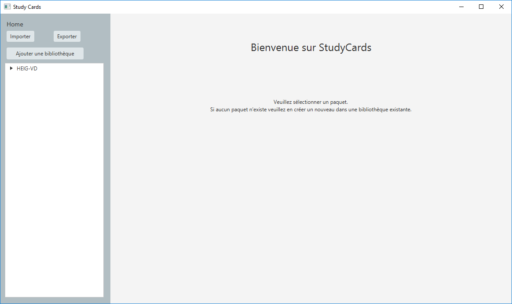
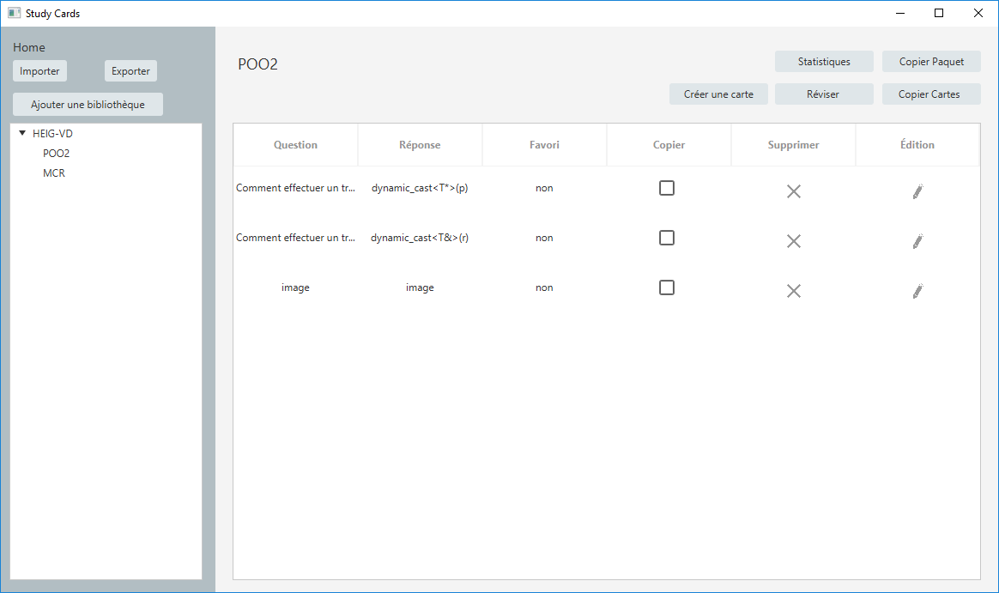
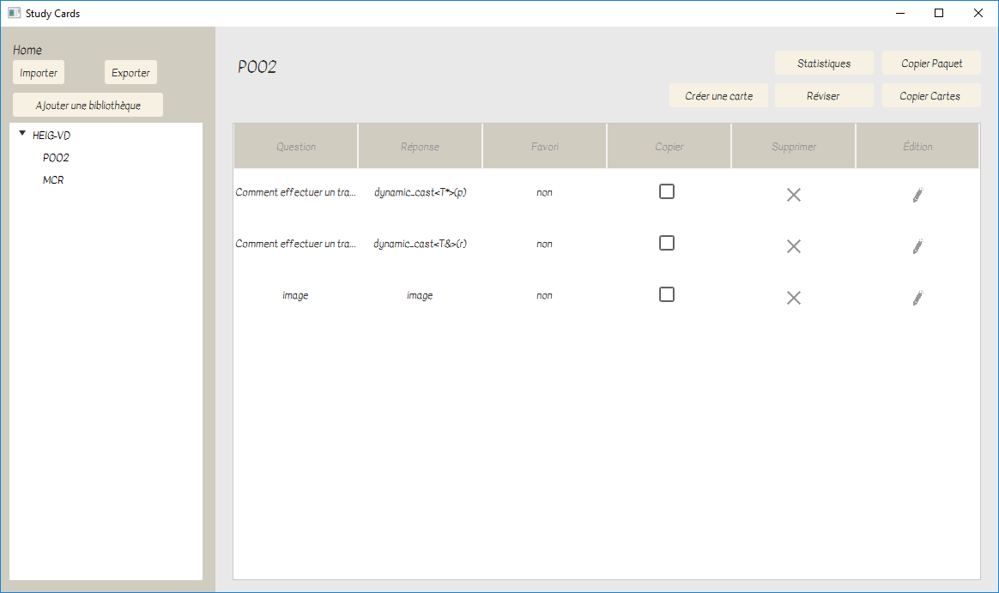
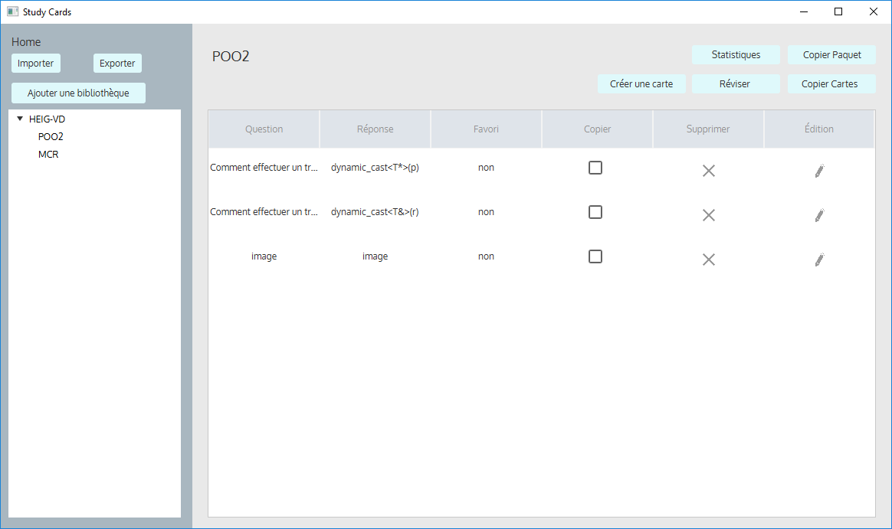
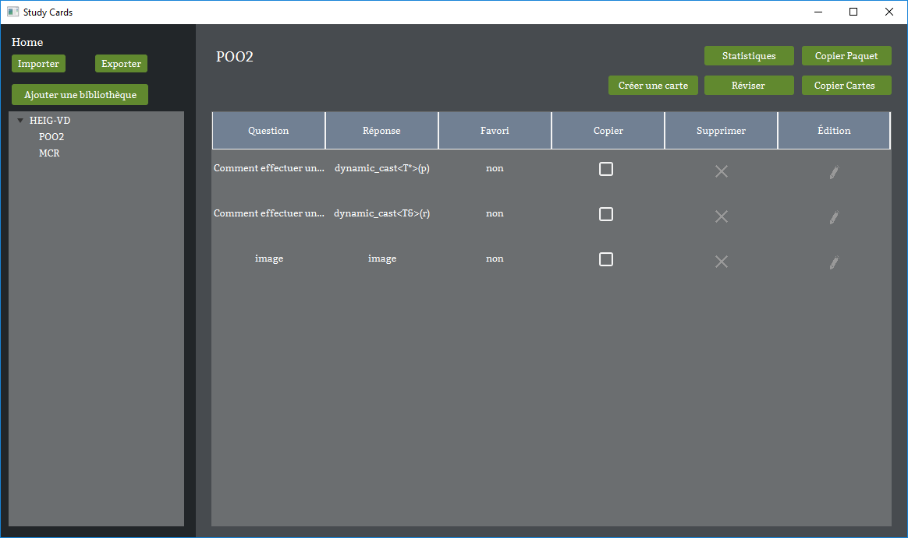
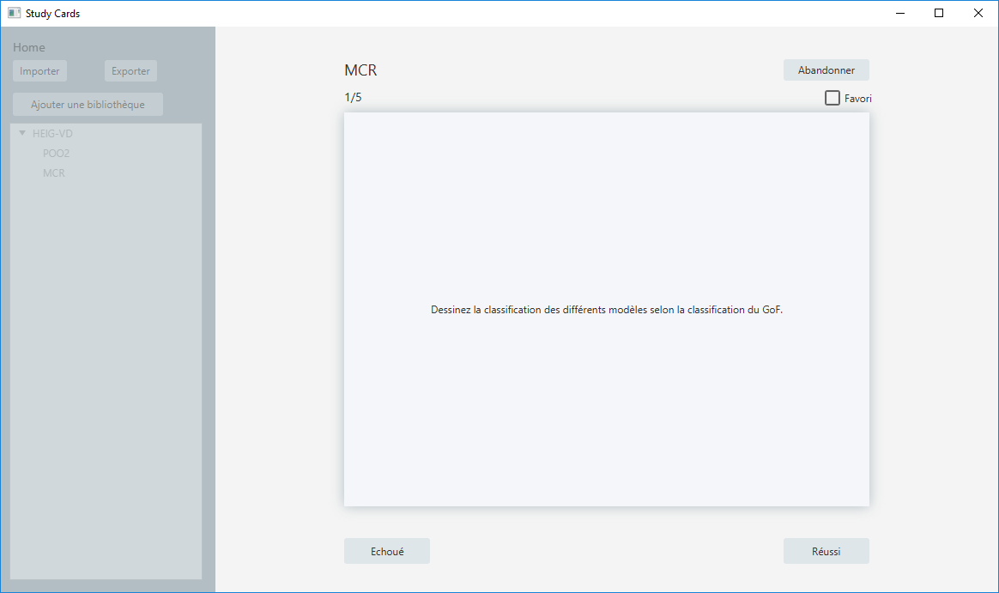
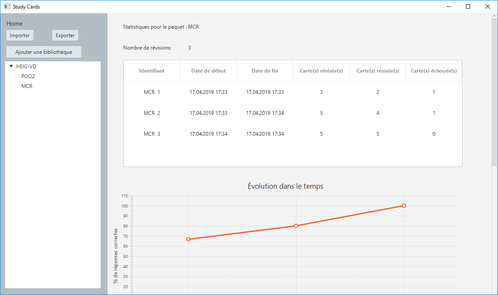
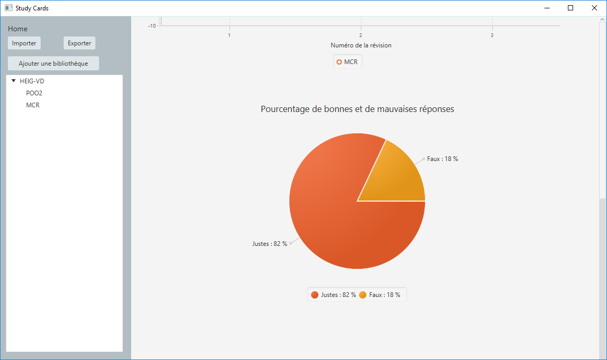

# StudyCards

Studycards is a Java application to learn with the flashcard system. 

You can download the application [here](./StudyCards.jar)

A guide in French can be found [here](./StudyCards-Manuel_utilisateur.pdf)

## Home Page

This application has several themes.

## Learning page

## Statistics Page

